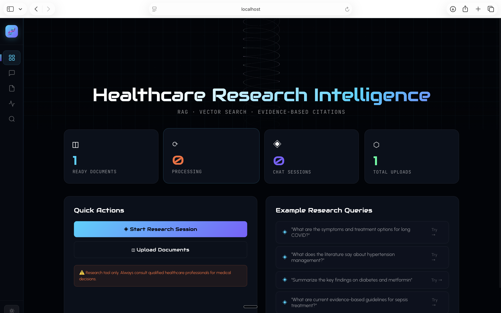
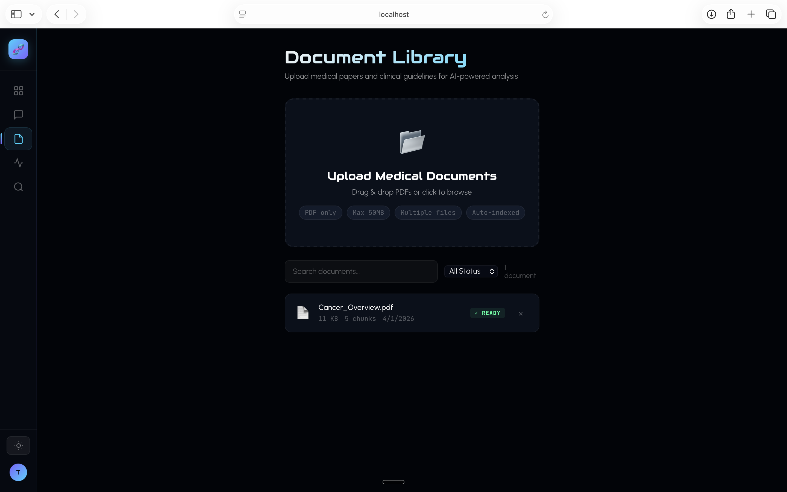
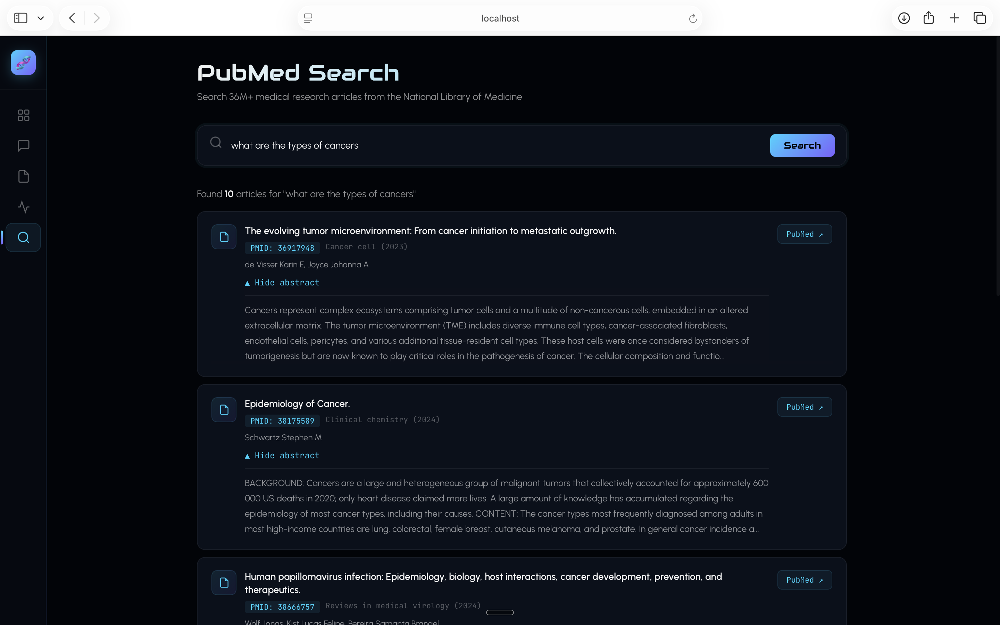
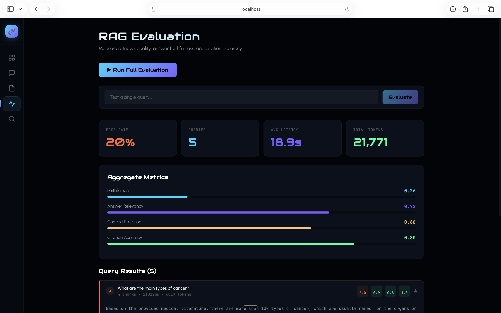
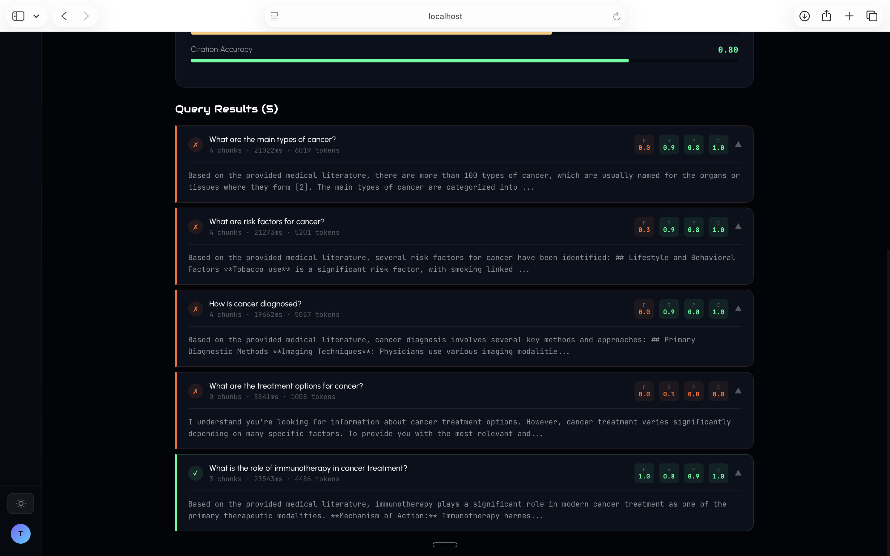

# 🧬 RO MEDRAG — Healthcare Research Intelligence Platform

> **Production-grade agentic RAG system** for AI-powered medical literature analysis with real-time streaming, PubMed integration, automated evaluation, and evidence-based citations.

[](https://python.org)
[](https://fastapi.tiangolo.com)
[](https://react.dev)
[](https://anthropic.com)
[](https://github.com/facebookresearch/faiss)
[](https://pubmed.ncbi.nlm.nih.gov/)
[](https://docker.com)
[](https://cloud.google.com)
[](https://www.romedrag.me)

<p align="center">
  <strong>🔗 Live Demo:</strong> <a href="https://www.romedrag.me">www.romedrag.me</a> · 
  <strong>📡 API Docs:</strong> <a href="https://healthcare-rag-backend-701918629622.us-central1.run.app/api/docs">Swagger UI</a> · 
  <strong>🎥 Register → Upload PDF → Ask Questions</strong>
</p>

---

## 📸 Screenshots

<div align="center">

### Dashboard


### Document Library


### PubMed Live Search


### RAG Evaluation Dashboard


### Evaluation Results


</div>

---

## 🎯 What It Does

RO MEDRAG is an **AI-powered research assistant** that lets medical researchers upload PDF papers, ask natural language questions, and receive evidence-based answers with source citations — all streamed in real-time.

Unlike basic RAG demos, this system features an **autonomous LangGraph agent** that:
- **Routes queries intelligently** — decides whether to retrieve, summarize, compare, extract data, or ask for clarification
- **Self-corrects** — validates its own answers against source material and regenerates if grounding fails
- **Re-queries automatically** — reformulates search queries when initial retrieval is insufficient
- **Searches live literature** — falls back to PubMed's 36M+ article database when local docs aren't enough
- **Measures its own quality** — built-in RAGAS-style evaluation pipeline with automated metrics

**Every answer is grounded in documents. Hallucination is structurally prevented.**

---

## 🏗️ System Architecture

```
┌────────────────────────────────────────────────────────────────────┐
│                         React Frontend                              │
│   Dashboard · Chat (SSE Streaming) · Documents · PubMed · Eval     │
│   Three.js 3D DNA · Framer Motion · Audiowide/Urbanist Typography  │
└──────────────────────────┬─────────────────────────────────────────┘
                           │ REST + SSE
┌──────────────────────────▼─────────────────────────────────────────┐
│                      FastAPI Backend                                │
│                                                                     │
│  ┌─────────────────── LangGraph Agent ──────────────────────────┐  │
│  │                                                               │  │
│  │  ┌──────────┐                                                 │  │
│  │  │  Router   │ → Classify intent (retrieve/summarize/         │  │
│  │  │  Node     │   compare/extract/clarify)                     │  │
│  │  └────┬─────┘                                                 │  │
│  │       │                                                       │  │
│  │  ┌────▼─────┐    ┌─────────────┐    ┌──────────────┐         │  │
│  │  │ Retrieve  │◄──│ Reformulate │◄──│  Evaluate     │         │  │
│  │  │ (FAISS)   │──►│ Query       │──►│  Sufficiency  │         │  │
│  │  └────┬─────┘    └─────────────┘    └──────────────┘         │  │
│  │       │                                                       │  │
│  │  ┌────▼─────┐    ┌─────────────┐                             │  │
│  │  │ Generate  │──►│  Validate   │──► Self-correction loop     │  │
│  │  │ (Claude)  │◄──│  Grounding  │                             │  │
│  │  └────┬─────┘    └─────────────┘                             │  │
│  │       │                                                       │  │
│  │  ┌────▼─────┐                                                 │  │
│  │  │ Finalize  │ → Citations + Metrics + Confidence             │  │
│  │  └──────────┘                                                 │  │
│  └───────────────────────────────────────────────────────────────┘  │
│                                                                     │
│  Services: EmbeddingService · FAISSVectorStore · PubMedService     │
│            EvalService · ConversationMemory · PDFParser             │
└──────────────────────────┬─────────────────────────────────────────┘
                           │
              ┌────────────▼────────────┐
              │    PostgreSQL + FAISS    │
              │  Users · Documents ·     │
              │  Chunks · Sessions ·     │
              │  Messages · Citations    │
              └─────────────────────────┘
```

---

## ⚙️ Tech Stack

| Layer | Technology | Why |
|-------|-----------|-----|
| **AI Agent** | LangGraph (custom) | Autonomous routing, retrieval loops, self-correction |
| **LLM** | Claude Sonnet 4 | Best instruction-following, lowest hallucination |
| **Streaming** | SSE (Server-Sent Events) | Real-time token-by-token output |
| **Embeddings** | OpenAI text-embedding-3-small | Best price/quality ratio (1536-dim) |
| **Vector DB** | FAISS (IndexFlatIP) | Zero cost, cosine similarity on normalized vectors |
| **Literature** | PubMed E-utilities API | 36M+ medical articles, free, no API key needed |
| **Evaluation** | Custom RAGAS-style metrics | Faithfulness, relevancy, precision, citation accuracy |
| **Backend** | FastAPI + asyncpg | Async, fast, typed, production-ready |
| **Database** | PostgreSQL 16 | Relational integrity for citations and audit trail |
| **PDF** | pypdf + pdfminer fallback | Handles messy/scanned PDFs with dual-parser strategy |
| **Frontend** | React 18 + Three.js | 3D DNA helix, Framer Motion animations |
| **Typography** | Audiowide + Urbanist | Cyber-medical display + clean readable body |
| **Auth** | JWT (access + refresh) + bcrypt | Stateless, secure, with token rotation |
| **Deploy** | Docker + GCP Cloud Run | Serverless, auto-scale, zero-downtime |

---

## 🧠 Key Features

### 1. Agentic RAG with LangGraph
Not a simple retrieve-and-generate pipeline. The agent autonomously:
- **Routes queries** to the optimal action (retrieve / summarize / compare / extract / clarify)
- **Re-queries with reformulated terms** when initial retrieval scores are low
- **Validates answers** against source chunks and regenerates if grounding fails
- **Maintains conversation memory** across turns for multi-turn research sessions

### 2. Real-Time Streaming (SSE)
Responses stream token-by-token via Server-Sent Events, with live status updates:
```
Analyzing query... → Searching documents... → Found 4 passages → Generating response...
```
No more staring at a loading spinner for 20 seconds.

### 3. PubMed Live Search
When uploaded documents don't have enough information, search PubMed's database of 36M+ biomedical articles. Results include titles, authors, journals, abstracts, and direct links to PubMed.

### 4. RAG Evaluation Pipeline
Automated quality metrics inspired by RAGAS:
- **Faithfulness** — Is the answer grounded in retrieved context?
- **Answer Relevancy** — Does it address the question?
- **Context Precision** — Are retrieved chunks relevant?
- **Citation Accuracy** — Do [N] references map to real chunks?

Run the full suite or test individual queries. Track pass rates over time.

### 5. Citation-Linked PDF Viewer
Click any citation → the original PDF opens in a modal, scrolled to the exact page. PubMed citations link directly to the article.

### 6. Dark/Light Theme
Toggle between dark glassmorphism and clean light mode. Persists across sessions.

### 7. Mobile Responsive
Collapsible sidebar with hamburger menu, stacked layouts, touch-friendly sizing.

---

## 🔐 Healthcare Safety

Non-negotiable safety constraints built into the system:

| Constraint | Implementation |
|-----------|---------------|
| Zero hallucination | LLM sees only retrieved chunks, never generates from memory |
| Mandatory citations | Every claim must include [1], [2] references |
| Insufficient evidence path | Agent returns "INSUFFICIENT_EVIDENCE" when context is absent |
| Self-validation | Agent cross-checks its own answer against sources |
| Medical disclaimer | Every response ends with "⚠️ Not medical advice" |
| Deterministic output | `temperature=0` for reproducible results |

---

## 🚀 Quick Start (5 minutes)

### Prerequisites
- Docker & Docker Compose
- Anthropic API key ([get one](https://console.anthropic.com/))
- OpenAI API key ([get one](https://platform.openai.com/api-keys)) — for embeddings only

### 1. Clone and configure

```bash
git clone https://github.com/rohithkandula19/Ro-MedRag.git
cd Ro-MedRag

cp backend/.env.example backend/.env
# Edit backend/.env with your API keys
```

### 2. Start with Docker Compose

```bash
docker-compose up --build
```

### 3. Open the app

```
http://localhost:3000
```

Register → Upload a PDF → Start asking questions.

---

## 🔧 Manual Setup (without Docker)

### Backend

```bash
cd backend
python -m venv venv
source venv/bin/activate
pip install -r requirements.txt
mkdir -p data/uploads data/faiss_index

# Start PostgreSQL
docker run -d --name postgres -e POSTGRES_PASSWORD=postgres \
  -e POSTGRES_DB=healthcare_rag -p 5432:5432 postgres:16-alpine

# Start backend
uvicorn app.main:app --reload --port 8000
```

### Frontend

```bash
cd frontend
npm install
npm run dev
```

---

## 🔌 API Reference

### Core Endpoints

| Method | Endpoint | Description |
|--------|----------|-------------|
| POST | `/api/auth/register` | Create account |
| POST | `/api/auth/login` | Get JWT tokens |
| GET | `/api/auth/me` | Current user |
| POST | `/api/documents/upload` | Upload PDF (async processing) |
| GET | `/api/documents/` | List documents |
| DELETE | `/api/documents/{id}` | Delete + remove from vector store |
| POST | `/api/chat/sessions` | Create chat session |
| POST | `/api/chat/sessions/{id}/query` | RAG query (standard) |
| POST | `/api/chat/sessions/{id}/stream` | **RAG query (SSE streaming)** |
| GET | `/api/chat/sessions/{id}/messages` | Chat history with citations |

### New v2 Endpoints

| Method | Endpoint | Description |
|--------|----------|-------------|
| GET | `/api/pubmed/search?q=...` | **Search PubMed articles** |
| POST | `/api/eval/run` | **Run full evaluation suite** |
| POST | `/api/eval/single` | **Evaluate single query** |
| GET | `/api/viewer/{id}/pdf` | **Serve PDF for citation viewer** |
| GET | `/api/health/` | Health check |

Interactive docs: `http://localhost:8000/api/docs`

---

## 📁 Project Structure

```
ro-medrag/
├── backend/
│   ├── app/
│   │   ├── main.py                    — FastAPI app, middleware, all route registration
│   │   ├── core/
│   │   │   ├── config.py              — Settings (pydantic-settings, env vars)
│   │   │   ├── security.py            — JWT auth, bcrypt, dependencies
│   │   │   └── logging.py             — Structured JSON logging
│   │   ├── db/
│   │   │   └── database.py            — Async SQLAlchemy engine + sessions
│   │   ├── models/
│   │   │   ├── user.py                — User, Document, ChatSession ORM models
│   │   │   ├── chat.py                — Message, Citation models
│   │   │   └── document.py            — Document, DocumentChunk models
│   │   ├── api/routes/
│   │   │   ├── auth.py                — Register, login, me
│   │   │   ├── documents.py           — Upload, list, delete
│   │   │   ├── chat.py                — Sessions, messages, query
│   │   │   ├── streaming.py           — SSE streaming endpoint
│   │   │   ├── pubmed.py              — PubMed search API
│   │   │   ├── eval.py                — RAG evaluation endpoints
│   │   │   ├── viewer.py              — PDF serving for citation viewer
│   │   │   ├── admin.py               — Admin statistics
│   │   │   └── health.py              — Health checks
│   │   └── services/
│   │       ├── rag_pipeline.py        — Core RAG: parse → chunk → embed → retrieve → generate
│   │       ├── agent/                 — ★ LangGraph Agent System
│   │       │   ├── state.py           — AgentState dataclass (shared graph state)
│   │       │   ├── tools.py           — 6 agent tools (retrieval, reformulation, comparison, 
│   │       │   │                        extraction, sufficiency evaluation, answer validation)
│   │       │   ├── nodes.py           — 8 graph nodes (route, retrieve, evaluate, reformulate,
│   │       │   │                        compare, generate, validate, finalize)
│   │       │   └── graph.py           — MedRAGAgent orchestrator with conditional loops
│   │       ├── pubmed_service.py      — PubMed E-utilities integration
│   │       ├── eval_service.py        — RAGAS-style evaluation metrics
│   │       ├── chat_service.py        — Session & query orchestration
│   │       ├── document_service.py    — Upload & async ingestion
│   │       └── user_service.py        — Auth CRUD
│   ├── requirements.txt
│   ├── Dockerfile
│   └── .env.example
├── frontend/
│   ├── src/
│   │   ├── App.jsx                    — Route definitions (6 pages)
│   │   ├── components/
│   │   │   ├── ui/Layout.jsx          — Collapsible icon sidebar, theme toggle
│   │   │   ├── auth/LoginPage.jsx     — Login/register with 3D background
│   │   │   ├── dashboard/Dashboard.jsx — Stats, quick actions, 3D hero
│   │   │   ├── chat/ChatPage.jsx      — ★ Streaming chat with SSE, citation cards, PDF viewer
│   │   │   ├── documents/DocumentsPage.jsx — Drag-drop upload, status tracking
│   │   │   ├── evaluation/EvaluationPage.jsx — ★ RAG metrics dashboard
│   │   │   ├── pubmed/PubMedPage.jsx  — ★ PubMed article search
│   │   │   └── 3d/Scene3D.jsx         — Three.js DNA helix + particles
│   │   ├── store/
│   │   │   ├── authStore.js           — Zustand auth state
│   │   │   └── themeStore.js          — Dark/light theme persistence
│   │   ├── services/api.js            — Axios client with JWT interceptors
│   │   └── styles/globals.css         — Design system (Audiowide + Urbanist)
│   ├── index.html
│   ├── vite.config.js
│   └── package.json
├── scripts/
│   └── deploy_gcp.sh                  — Full GCP deployment (Cloud Run + Cloud SQL)
├── docker-compose.yml
└── README.md
```

---

## 🧠 Agent Architecture Deep Dive

The LangGraph agent uses a **graph-based workflow** with conditional edges:

```
Query → Router → [Action Decision]
                    │
         ┌─────────┼──────────┬──────────┐
         ▼         ▼          ▼          ▼
      Retrieve   Compare   Extract    Clarify
         │         │          │          │
         ▼         │          │          ▼
    ┌─Evaluate─┐   │          │       Finalize
    │Sufficient?│   │          │
    └──┬───┬───┘   │          │
   Yes │   │ No    │          │
       │   ▼       │          │
       │ Reformulate           │
       │   │       │          │
       │   └►Retrieve          │
       ▼                       ▼
    Generate ◄────────────────┘
       │
       ▼
    Validate ──┐
       │       │ Failed
       │       └►Regenerate
       ▼
    Finalize → Response + Citations + Metrics
```

**Key behaviors:**
- **Retrieval loop**: Up to 3 attempts with automatic query reformulation
- **Validation loop**: Up to 2 regeneration attempts if grounding check fails
- **Conversation memory**: Agent remembers previous turns for multi-turn research
- **Confidence scoring**: Average relevance score across retrieved chunks

---

## 📊 RAG Evaluation Metrics

| Metric | What It Measures | How |
|--------|-----------------|-----|
| **Faithfulness** | Is every claim supported by context? | LLM-as-judge grounding check |
| **Answer Relevancy** | Does the answer address the question? | LLM-as-judge relevance rating |
| **Context Precision** | Are retrieved chunks relevant? | Keyword overlap + expected term matching |
| **Citation Accuracy** | Do [N] references exist in retrieved chunks? | Regex extraction + set comparison |

Run via API: `POST /api/eval/run` or from the Evaluation page in the UI.

---

## ☁️ GCP Deployment

```bash
chmod +x scripts/deploy_gcp.sh
./scripts/deploy_gcp.sh YOUR_PROJECT_ID us-central1
```

The script handles: Cloud SQL setup, GCS bucket with versioning, Secret Manager for API keys, Artifact Registry for Docker images, Cloud Run deployment with auto-scaling.

**Estimated cost:** ~$22/month for light usage.

---

## 💼 Skills Demonstrated

```
• Architected LangGraph agentic RAG system with autonomous query routing,
  iterative retrieval with reformulation, and self-correcting answer validation
• Implemented real-time SSE streaming for token-by-token LLM responses
  with multi-phase status updates across the agent pipeline
• Integrated PubMed E-utilities API as a live literature search tool,
  enabling the agent to augment local documents with 36M+ medical articles
• Built automated RAG evaluation pipeline measuring faithfulness, answer
  relevancy, context precision, and citation accuracy (RAGAS-inspired)
• Designed citation-linked PDF viewer with page-level deep linking
  for source verification in a medical research context
• Engineered full-stack React + FastAPI application with JWT auth,
  async PostgreSQL, FAISS vector search, and Docker deployment
• Created responsive UI with dark/light theme, collapsible icon sidebar,
  3D Three.js visualization, and Audiowide/Urbanist typography system
```

---

## ⚠️ Disclaimer

**This software is not FDA approved and must not be used for clinical decision-making.**

For research and educational purposes only. Always consult qualified healthcare professionals for medical decisions.

---

## 📄 License

MIT — For research and educational purposes.
